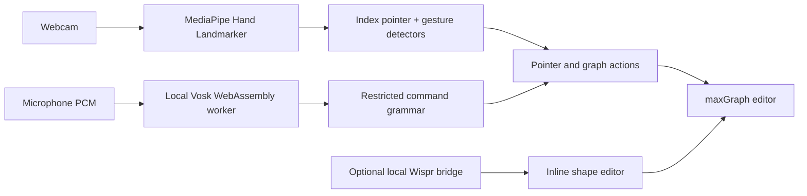

# AirDrawio

AirDrawio is a hands-free, diagrams.net-style editor controlled with a webcam and low-latency local voice commands. Point with your index finger, speak deliberate actions such as **select**, **hold**, **release**, or **draw**, and keep using the same diagram with a mouse, trackpad, and keyboard whenever you want.

The editor is built on [maxGraph](https://maxgraph.github.io/maxGraph/), the maintained TypeScript successor to the graph engine used by diagrams.net. Keeping the graph engine in the same page lets camera-driven pointer input reach real selection, resize, drag, text, and connector behavior.

## Highlights

- Real maxGraph shapes, handles, selection, resizing, labels, undo, and attached connectors
- Camera pointer controlled by the index fingertip
- Browser-local Vosk command recognition with a small, fast command grammar
- Air Pen drawing: tuck the thumb to draw and open it to finish
- Automatic cleanup of hand-drawn rectangles, ellipses, lines, arrows, and text marks
- Smooth editable curves for strokes that are intentionally curved
- Voice-controlled shape creation, dragging, multi-selection, deletion, copy, cut, and paste
- Connector arrows snapped to the nearest point on a shape perimeter
- Point-relative gesture zoom with a deliberate reset phase between strokes
- Optional Wispr Flow integration for free-form shape renaming on macOS
- Black camera preview showing only the hand skeleton
- Live microphone waveform and recognition status
- Guided voice-and-camera control tests
- Mouse, trackpad, keyboard, and optional pinch fallbacks

## Requirements

- Node.js 20 or newer
- npm
- A modern Chromium browser; Google Chrome is recommended
- A webcam and microphone
- An internet connection the first time hand tracking starts, because the pinned MediaPipe runtime and hand model are loaded from their hosted URLs
- macOS plus Xcode Command Line Tools only if you want the optional Wispr Flow hotkey bridge

## Install and run

```bash
git clone https://github.com/adi3120/AirDrawio.git
cd AirDrawio
npm install
npm run dev
```

Open [http://127.0.0.1:5173](http://127.0.0.1:5173), select **Gesture**, and allow camera and microphone access.

The local command model is included in the repository at `public/models/vosk-small-en-in.model`; normal voice commands do not use Chrome speech recognition or send microphone audio to a speech service. The model can take a moment to initialize on the first Gesture Mode start. Wait until the status says **Hand + local voice ready**.

On macOS, you can also double-click `scripts/start-airdrawio.command` after installing dependencies.

### Production build and tests

```bash
npm test
npm run build
npm run preview
```

## First-use setup

1. Start AirDrawio and open it in Chrome.
2. Select **Gesture** in the top bar.
3. Allow both camera and microphone access.
4. Keep one complete hand inside the camera frame.
5. Wait for **Hand + local voice ready** before speaking a command.
6. Move your index fingertip and confirm the on-screen pointer follows it.

The voice graph reacts to raw microphone input. If it moves but no command is shown, wait for the local model to finish loading and use one of the exact short commands below. If it stays flat, confirm Chrome's microphone permission and the selected macOS input device.

## Air Pen drawing

Say **“draw”** to arm the Air Pen.

1. Hold your hand in a comfortable open-thumb pose for a brief moment. AirDrawio learns that pose as your personal baseline each time the pen is armed.
2. Tuck your thumb toward your palm and hold it there briefly. Ink starts at the current pointer position.
3. Trace the object with your index fingertip.
4. Open your thumb to finish the stroke.
5. Say **“stop drawing”** to put the pen away.

Thumb detection is normalized by palm size, prefers orientation-independent 3D landmarks, and compares closing against the open pose you just showed. It also tolerates brief landmark jitter, so one noisy frame does not cancel a deliberate close. You do not need to point your thumb toward the camera.

Closed shapes are cleaned into rectangles or ellipses. Straight strokes become lines; arrow-like strokes become connector arrows; text-like marks become editable text. Deliberately curved strokes remain curves and are smoothed instead of being straightened.

For best results, keep the full hand visible, make the open/closed difference clear, and draw objects at least a few centimetres wide on screen.

## Voice controls

Commands use a restricted offline grammar for speed and reliability. Speak a short command, pause briefly, and then continue moving your hand.

| Action | Say |
| --- | --- |
| Click the hovered target | “Select” or “left click” |
| Select a hovered shape | “Select that shape” |
| Begin a drag or marquee | “Hold” |
| Finish a drag | “Release” |
| Right mouse input | “Right click” or “right hold” |
| Create at the pointer | “Rectangle”, “ellipse”, or “text” |
| Choose a tool | “Pointer”, “line”, “connector”, or “pan” |
| Draw a straight line | “Line start”, move, then “release” |
| Start an attached arrow | “Start arrow”, move to the destination, then “end arrow” |
| Choose an exact connector side | “Select top”, “select bottom”, “select left”, or “select right” |
| Start/stop Air Pen | “Draw” / “stop drawing” |
| Start/stop gesture zoom | “Zoom” / “end zoom” |
| Edit a name with Wispr | “Rename” / “done” |
| Edit using built-in command dictation | “Edit text” / “right shift” |
| Clipboard | “Copy”, “cut”, or “paste” |
| History and removal | “Undo”, “redo”, or “delete” |
| Cancel the current action | “Cancel” |

The local grammar safely accepts the common substitutions **old** for **hold** and **please** for **release** only when they are the complete recognized command.

### Multi-select, move, delete, copy, and paste

With **Pointer** active, point at empty canvas, say **“hold”**, sweep a marquee around several objects, and say **“release.”** Then:

- Say **“hold”** over any selected object to move the group; say **“release”** to drop it.
- Say **“delete”** to remove the selected group.
- Say **“copy”** or **“cut”**, point to the desired location, and say **“paste.”**

Mouse users can make the same marquee selection or use Shift-click to adjust the selection.

### Lines and connectors

For a free straight line, say **“line”** to choose the Line tool, point at the start, say **“line start”** or **“hold”**, move to the endpoint, and say **“release.”**

For an attached connector, hover over the source shape and say **“start arrow.”** AirDrawio snaps the source to the closest point on the shape perimeter. Move to the destination and say **“end arrow”**; the destination also snaps to its closest perimeter point. The connector stays attached as either box moves.

You can use **select top**, **select bottom**, **select left**, or **select right** when an exact side-center anchor is preferred.

### Gesture zoom

Point at the position that should remain under the cursor and say **“zoom.”** A clear move toward the camera while opening the thumb and index finger zooms in; a clear move away while closing them zooms out. After a completed zoom stroke, return to a comfortable pose and pause before making another deliberate stroke. Reverse motion during this reset does not undo the previous zoom. Say **“end zoom”** to restore normal controls.

## Wispr Flow rename setup (optional, macOS)

Wispr is used only for free-form renaming. Hover over a box and say **“rename.”** AirDrawio opens the real inline editor and sends the configured double-Fn hotkey to Wispr. Dictate the new name, then say **“done”**; AirDrawio sends one Fn tap, waits for the final insertion, and saves the label.

The browser cannot send a trusted system-wide Fn key by itself, so the Vite development server builds a small local macOS bridge. To enable it:

1. Install Xcode Command Line Tools if `xcode-select -p` does not return a path: `xcode-select --install`.
2. Open **System Settings → Privacy & Security → Accessibility**.
3. Enable the terminal application that starts AirDrawio, such as Terminal or Ghostty.
4. If AirDrawio shows an exact `node` executable path, add and enable that executable too.
5. Completely quit and reopen the terminal application after granting access.
6. Start AirDrawio again from that approved terminal with `npm run dev`.

Accessibility approval belongs to the process that actually starts Vite. Enabling Terminal does not help a server launched from Ghostty, an IDE, or another background host.

## Optional pinch fallback

Voice actions are enabled and pinch actions are disabled by default. Turn on **Pinch fallback** to use camera-only clicking and dragging. The ten-sample trainer records normalized distances only; it never saves camera images. Include both front-facing and side-on hand angles while training.

## Guided test

Select **Test controls** in the top bar to run the guided voice-and-camera checks. The flow creates temporary shapes, explains each requested action, verifies the actual canvas result, offers more exact coaching when a step fails, and records a final pass/fail summary. Closing the test removes its temporary shapes.

## Keyboard fallback

- `V`: pointer
- `R`: rectangle
- `O`: ellipse
- `A`: free line
- `C`: connector arrow
- `T`: text
- `H`: pan
- `Delete` or `Backspace`: remove selection
- `Cmd/Ctrl + Z`: undo
- `Cmd/Ctrl + Shift + Z`: redo

## Architecture



See [docs/architecture.md](docs/architecture.md), [docs/development.md](docs/development.md), and [docs/gesture-model.md](docs/gesture-model.md) for implementation details.

## Privacy and limitations

- Voice commands are decoded locally in the browser. Wispr is invoked only for the optional rename workflow and follows Wispr's own privacy behavior.
- Hand landmarks are processed in the page; AirDrawio does not store camera frames.
- MediaPipe assets are currently hosted and require network access on first initialization.
- Script-generated pointer events cannot operate browser-owned permission prompts or native browser menus.
- The optional Wispr bridge works only on macOS and requires Accessibility permission.
- This prototype uses maxGraph directly rather than reproducing the complete diagrams.net application shell.

## Project status

This is an active prototype. See [PROGRESS.md](PROGRESS.md) for implemented milestones and remaining work.
