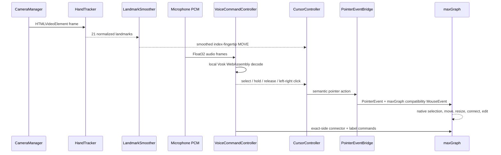

# Architecture

## Decision: same-origin maxGraph integration

The initial architecture review considered two paths:

1. Embed the hosted diagrams.net editor in an iframe.
2. Integrate the graph engine directly in the application.

The iframe path is smaller only until gesture input is introduced. Hosted diagrams.net is cross-origin, and the browser does not allow the parent page to inspect iframe hit targets or dispatch pointer events into its document. The official embed API is excellent for loading and saving diagrams, but it is not an input-injection API.

AirDrawio therefore uses maxGraph in the React page. maxGraph is the maintained TypeScript successor to mxGraph and retains the graph model, resize and selection handlers, connection model, text editing, undoable model transactions, and XML-compatible lineage needed by the prototype. This keeps every voice/camera target in one DOM and proves the interaction loop without maintaining a full draw.io fork.

## Runtime flow

## Modules

- `camera/CameraManager.ts` owns `getUserMedia`, playback, and stream cleanup.
- `tracking/HandTracker.ts` owns MediaPipe initialization and video inference.
- `tracking/LandmarkSmoother.ts` uses velocity-sensitive exponential smoothing.
- `voice/VoiceCommandController.ts` owns the browser-local Vosk recognizer, restricted command grammar, partial-result timing, and command mode.
- `voice/VoiceInputMonitor.ts` owns microphone capture, the Web Audio analyser used by the live waveform, and the PCM stream fed to Vosk.
- `voice/voiceCommandModel.ts` normalizes and parses the explicit command grammar.
- `drawing/ThumbDrawDetector.ts` learns a per-session open-thumb baseline and applies hysteresis to Air Pen start/stop transitions.
- `drawing/AirStrokeRecognizer.ts` classifies and cleans completed Air Pen strokes while preserving intentional curves.
- `gestures/PinchDetector.ts` provides the optional 3D pinch fallback.
- `gestures/GestureStateMachine.ts` owns optional pinch state transitions.
- `cursor/CoordinateMapper.ts` maps mirrored normalized points to viewport coordinates.
- `cursor/CursorController.ts` updates the high-frequency cursor DOM outside React rendering.
- `drawio/PointerEventBridge.ts` converts semantic actions to pointer input.
- `drawio/DrawioController.ts` configures maxGraph and creates exact-side voice connectors using persistent entry/exit anchors.
- `export/diagramExport.ts` converts the object-style maxGraph model into diagrams.net-compatible legacy `mxGraphModel` XML.
- `export/rasterExport.ts` paints clean graph states into SVG before browser-local PNG or JPEG encoding.
- `drawio/infiniteCanvas.ts` keeps the grid and rulers aligned with scale, committed translation, and live pan previews.

## High-frequency data

Landmarks and cursor position are processed in `requestAnimationFrame` using controller objects and refs. React state is updated at a lower cadence for human-readable status displays. This avoids re-rendering the application for every camera frame.

The graph uses view translation rather than container scroll offsets for panning. This removes finite HTML scroll boundaries while preserving exact model coordinates for creating, pasting, connecting, zooming, and exporting cells.

## Cleanup and failure behavior

Disabling Voice + Camera cancels the animation loop and local recognizer, releases any pending pointer state, closes the MediaPipe task, stops camera and microphone tracks, clears preview drawing, and resets smoothing. If the hand disappears for more than 180 ms, a single `HAND_LOST` transition forces pointer release so maxGraph cannot remain stuck in a drag.

## Future compatibility

`DrawioBridge` separates UI actions from the current maxGraph controller. A future full diagrams.net fork can implement the same interface. `DiagramRefiner` is an intentionally empty future boundary for AI-assisted layout.
