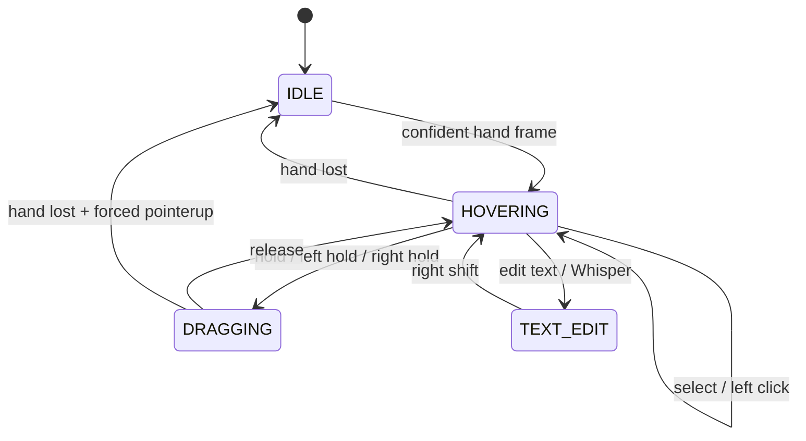

# Voice and camera interaction model

## Camera position, voice action

The hand is treated as a pointing device: index-fingertip motion maps continuously to pointer motion. Speech supplies discrete button actions. This split keeps spatial targeting fast while avoiding the ambiguity of holding a pinch during precise drags.

Voice actions are enabled and pinch actions are disabled by default.

## Command grammar

| Intent | Accepted phrases |
| --- | --- |
| Primary click | `select`, `left click`, `click` |
| Select diagram cell | `select that shape` |
| Primary drag | `hold`, `select and hold`; then `release` |
| Marquee selection | With Pointer active, `hold` on empty canvas, sweep the region, then `release` |
| Straight line | Select Line, `hold` at the start, move, then `release` |
| Secondary input | `right click`, `right hold`; then `release` |
| Anchored connector | `select top`, `select bottom`, `select left`, `select right` |
| Label dictation | `edit text` or `Whisper`; then `right shift` to finish |
| Tools | `pointer`, `line`, `connector`, `pan` |
| Editing | `undo`, `redo`, `delete`, `cancel` |

Final speech results are normalized for capitalization, punctuation, and whitespace before exact intent matching. Ordinary label text is ignored while in command mode so it cannot accidentally fire a diagram action.

## Exact connector anchors

The first side command latches the vertex under the cursor as the source. The second side command must target a different vertex and creates an edge with fixed `exitX`/`exitY` and `entryX`/`entryY` values. The top and bottom points use horizontal center; left and right use vertical center. A visible marker shows the pending source.

## In-app Whisper flow

`Whisper` and `edit text` enter label-dictation mode for the hovered or selected shape. Recognized phrases replace the label and then append until `right shift` is spoken. The browser cannot generate a trusted global keyboard event for native OpenWhispr; that integration requires a desktop bridge and macOS Accessibility permission.

## Optional pinch fallback

### Orientation-independent pinch ratio

MediaPipe provides both projected image landmarks and 3D world landmarks. The detector prefers the 3D set, so turning a hand sideways does not make a real fingertip touch appear farther apart. Distance is normalized by the longest stable palm span:

```text
pinchRatio = distance(thumbTip, indexTip)
             --------------------------------
             max(
               distance(indexMCP, pinkyMCP),
               distance(wrist, middleMCP),
               distance(wrist, indexMCP),
               distance(wrist, pinkyMCP)
             )
```

World-landmark distance includes x, y, and z. If world landmarks are unavailable, the same robust palm scale is used in projected 2D. This fallback avoids the old failure where `indexMCP → pinkyMCP` collapsed as the palm turned perpendicular to the camera.

Default hysteresis:

```text
start candidate below 0.46
confirm after 55 ms
remain pinched until above 0.62
cool down for 90 ms after release
```

The two thresholds prevent oscillation near the boundary. A minimum duration filters single-frame landmark noise.

### Personal training

The **Train pinch** flow captures ten comfortable examples as normalized numeric ratios. It does not retain camera frames. The learned boundary is placed above the upper range of the captured examples using a robust median-deviation margin, then clamped to a safe operating range. The resulting profile is stored in browser local storage and loaded on the next visit.

When pinch fallback is enabled, one learned profile improves its selection, drag, resize, connection, and double-pinch actions.

## State machine



## Smoothing

The smoother is an exponential moving average with velocity-sensitive alpha:

```text
smoothed = alpha × current + (1 - alpha) × previous
```

Slow motion uses a lower alpha for precision. Fast motion raises alpha to reduce lag. A small screen-space dead zone removes sub-pixel tremor after mapping.

## Confidence and hand loss

Frames below the configured confidence threshold cannot move the camera cursor. A brief drop freezes interaction; sustained hand loss cancels the interaction. Any voice-held pointer is released before returning to `IDLE`.

## Optional double pinch

A completed pinch followed by another pinch start within 400 ms emits `DOUBLE_PINCH`. The pointer bridge converts that to the editor's double-click path. The interval is configurable from 250–650 ms.
